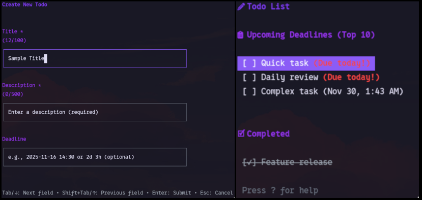

# doit

A feature-rich terminal-based todo application built with Go and
Bubbletea framework.

## Preview



## Features

- **Interactive TUI**: Beautiful terminal user interface powered by Bubbletea
- **Flexible Input**: Add todos via command-line arguments or interactive forms
- **Smart Sorting**: Automatic sorting by deadline with separate sections for
  different priorities
- **Streak Tracking**: Track your productivity with daily completion streaks
- **Persistent Storage**: Usees BBolt embedded database for reliable data storage
- **Deadline Management**: Visual indicators for overdue and upcoming deadlines
- **Colorful Interface**: Aesthetic and intuitive color-coded UI

## Installation

### Prerequisites

- Go 1.52.4 or higher

### Build from source

```bash
git clone https://github.com/akr411/doit.git
cd doit
go mod download
go build -o doit cmd/main.go
```

## Usage

### Command-Line Mode

Add a todo with title and description

```bash
doit -t "Buy groceries" -d "Milk, eggs, bread"
```

Add a todo with deadline (multiple formats supported):

```bash
# Absolute date and time
doit -t "Submit report" -d "Q4 financial report" -n "2025-12-01 17:00"

# Relative time from now
# 2 hours from now
doit -t "Quick fix" -d "Bug #123" -n "2h"
# 1 day from now
doit -t "Review PR" -d "Frontend changes" -n "1d"
# 1 week from now
doit -t "Sprint planning" -d "Next iteration" -n "1w"

# Combined relative times
# 2 weeks 3 days
doit -t "Project deadline" -d "Major features" -n "2w 3d"
# 1 day 2 hours 30 minutes
doit -t "Important meeting" -d "Client demo" -n "1d 2h 30m"
```

### Interactive Mode

Run without arguments to enter the interactive form:

```bash
doit
```

Navigate through fields using:

- `Tab` or `↓`: Next field
- `Shift-Tab` or `↑`: Previous field
- `Enter`: Submit form
- `Esc`: Cancel

### List View

View all todos in a beautiful list:

```bash
doit -list
```

List view controls:

- `?`: Show help
- `↓/↑` or `j/k`: Navigate through todos
- `Space`: Expand todo to see description
- `c`: Mark todo as complete/incomplete
- `d`: Delete todo
- `n`: Create new todo
- `r`: Refresh list
- `q`: Quit

## Features in Detail

### Deadline Formats

The app supports flexible deadline formats to make time management intuitive:

#### Absolute Format

Specify an exact date and time:

```bash
doit -t "Meeting" -d "Team standup" -n "2025-11-20 14:30"
```

#### Relative Formats

Use time relative to the current moment:

**Single Units:**

- `m` - minutes: `30m` (30 minutes from now)
- `h` - hours: `2h` (2 hours from now)
- `d` - days: `1d` (1 day from now)
- `w` - weeks: `2w` (2 weeks from now)
- `M` - months: `1M` (1 month from now)

**Examples:**

```bash
doit -t "Quick task" -d "Urgent fix" -n "30m"
doit -t "Daily review" -d "Check metrics" -n "1d"
```

**Combinations:**
Combine multiple time units for precise deadlines:

```bash
doit -t "Feature release" -d "v2.0" -n "1w 3d"
doit -t "Presentation" -d "Board meeting" -n "2d 4h"
```

The formats are case-insensitive, so `2D 2H` works the same as `2d 3h`.

### Smart Categorization

Todos are automatically organized into sections:

- **Upcoming Deadline**: Shows the top 10 todos with the nearest deadlines
- **No deadline**: Todos without specified deadlines
- **Completed**: Finished todos with strikethrough styling

### Visual deadline indicators

- Red text for overdue todos
- Orange text for todos due within 3 days
- Date display for todos with longer deadlines

### Streak Tracking

The app tracks your completion streaks:

- **Current streak**: Consecutive days with completions
- **Max streaks**: Your best achievement
- **Total completed**: Overall productivity metric
- Resets if you miss a day (24-hours cycle)

### Pagination

Large todo lists are automatically paginated:

- 10 items per page
- Navigate with `b/f`

## Technologies used

- **Go 1.15.4**
- **Bubbletea**: Elm-inspired TUI framework
- **Lipgloss**: Style library for beautiful terminal output
- **BBolt**: Embedded key-value database for persistence

## License

MIT License
